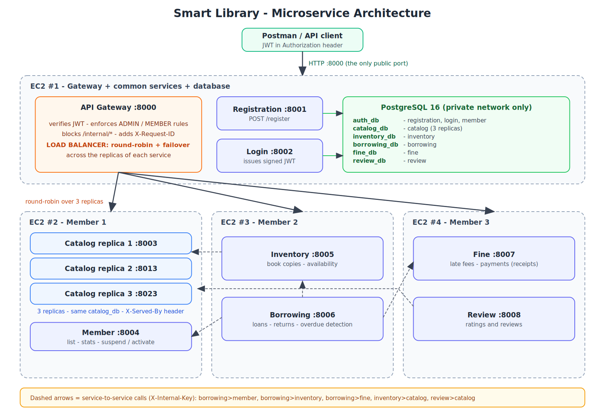

# Smart Library – Microservices Backend

A backend-only library management system built as **9 microservices** (FastAPI · PostgreSQL · JWT · Docker), with an **API Gateway that load-balances** replicated services, deployed on **4 EC2 instances** and tested with Postman. Team of 3.


*(vector version: [docs/architecture.svg](docs/architecture.svg))*

## Where to find what

| Topic | Where |
|---|---|
| Microservices, Docker, Compose | this README, `services/*/Dockerfile`, `docker-compose.yml`, `deploy/` |
| JWT, gateway, roles (RBAC) | [docs/SECURITY_RBAC.md](docs/SECURITY_RBAC.md) |
| Database schema, relationships, CRUD | [docs/DATABASE.md](docs/DATABASE.md) |
| **Load balancing** (replicas, failover, verification) | [docs/LOAD_BALANCING.md](docs/LOAD_BALANCING.md) |
| All API endpoints | [docs/API.md](docs/API.md) · Postman: `postman/SmartLibrary.postman_collection.json` |
| EC2 deployment | [docs/EC2_DEPLOYMENT.md](docs/EC2_DEPLOYMENT.md) |
| Tests and saved evidence | [docs/TESTING.md](docs/TESTING.md) · `evidence/` |
| Live demo script | [docs/DEMO_SCRIPT.md](docs/DEMO_SCRIPT.md) |

## Services

| Service | Port | Owner | Database | Responsibility |
|---|---|---|---|---|
| `gateway` | 8000 | Member 1 (common) | – | Public entry point: routing, **JWT validation, role rules, load balancing + failover**, blocks `/internal/*` |
| `registration-service` | 8001 | Member 2 (common) | `auth_db` | Sign-up (MEMBER; ADMIN only with the secret `X-Admin-Key`) |
| `login-service` | 8002 | Member 3 (common) | `auth_db` | Login → signed JWT, profile, token verify, change password |
| `catalog-service` ×3 replicas | 8003 / 8013 / 8023 | Member 1 | `catalog_db` | Books and categories: search, CRUD, ISBN validation |
| `member-service` | 8004 | Member 1 | `auth_db` | Member list/search, stats, profile, suspend / re-activate |
| `inventory-service` | 8005 | Member 2 | `inventory_db` | Physical copies, availability |
| `borrowing-service` | 8006 | Member 2 | `borrowing_db` | Borrow / return, loan limits, overdue detection |
| `fine-service` | 8007 | Member 3 | `fine_db` | Automatic late fees, manual fines, payments with receipts |
| `review-service` | 8008 | Member 3 | `review_db` | Ratings and reviews, per-book summary |

**Team split:** Member 1 – gateway, catalog, member (+ shared files, EC2 #1 and #2); Member 2 – registration, inventory, borrowing (EC2 #3); Member 3 – login, fine, review (EC2 #4). Guides: `docs/members/member-N.md`.

**Roles:** `ADMIN` (librarian) and `MEMBER`. **Services call each other over HTTP** (`X-Internal-Key` on `/internal/*` endpoints): borrowing → member (is the account active?), borrowing → inventory (reserve / release a copy), borrowing → fine (late fee), inventory → catalog and review → catalog (does the book exist?).

## Project requirements checklist
| Requirement | How it is met |
|---|---|
| ≥ 2 roles | `ADMIN`, `MEMBER` |
| API Gateway, Registration, Login + role-based JWT | `gateway`, `registration-service`, `login-service`; token checked at the gateway **and** in every service |
| ≥ 2 extra services per member | 2 each (6 services) → **9 total** |
| Backend only, with database | no UI; PostgreSQL, one database per service |
| ≥ 2–3 APIs per service, connected to the DB | 2–7 endpoints per service ([docs/API.md](docs/API.md)) |
| Separate EC2 instances (max 3–4), Postman | 4 instances, one compose file each, Postman collection |
| Load balancer | gateway round-robin over 3 Catalog replicas, failover, tests + evidence |

## Containerisation highlights
* One small `python:3.12-slim` image per service, **non-root user**, only runtime dependencies (each service has its own minimal `requirements.txt`), configuration only through environment variables.
* `HEALTHCHECK` in every Dockerfile; `restart: unless-stopped` everywhere; the gateway starts only when all services are *healthy*; services wait for a healthy PostgreSQL.
* Compose networks: `backend` (service traffic) and `db` (PostgreSQL – reachable only by services that need it; its port is not published). Only the gateway publishes a port.
* The same images run everywhere: local compose (all-in-one) or one compose file per EC2 instance.

## Run it

### Option A – no Docker (fastest, SQLite)
```bash
pip install -r requirements-dev.txt
python scripts/run_local.py          # all services + 3 Catalog replicas; gateway on http://localhost:8000
python tests/smoke_test.py           # ~75 end-to-end checks through the gateway
python tests/load_balancer_test.py   # proves the load balancing
```
Local admin key: `local-admin-key` (header `X-Admin-Key`). Delete `.local-data/` to reset.

### Option B – Docker Compose (PostgreSQL, everything on one machine)
```bash
cp .env.example .env                 # fill in the secrets
docker compose up --build
python tests/smoke_test.py http://localhost:8000 --admin-key <ADMIN_REGISTRATION_KEY>
# optional: publish every service port too
docker compose -f docker-compose.yml -f docker-compose.debug.yml up --build
```

### Option C – 4 EC2 instances → [docs/EC2_DEPLOYMENT.md](docs/EC2_DEPLOYMENT.md)

### Postman
Import `postman/SmartLibrary.postman_collection.json`, set `baseUrl` (gateway) and `adminKey`, then **Run collection**. 11 folders – one per service, plus **9 – Load balancing** (run with 30 iterations) and **10 – Load balancing evidence**. Every request asserts its expected status code.

## Configuration
| Variable | Used by | Meaning |
|---|---|---|
| `SECRET_KEY` | all | JWT signing key, ≥ 32 chars, **identical everywhere** |
| `INTERNAL_API_KEY` | member, inventory, borrowing, fine | secret for service-to-service calls |
| `ADMIN_REGISTRATION_KEY` | registration | needed in `X-Admin-Key` to create an ADMIN |
| `DATABASE_URL` | all except gateway | e.g. `postgresql+psycopg2://user:pw@host:5432/catalog_db` |
| `*_URL` (`CATALOG_URL`, `MEMBER_URL`, …) | gateway, inventory, borrowing, review | where a service lives – **comma-separated list = replicas to load-balance** |
| `INSTANCE_ID` | all | name returned in `X-Served-By` (default: container hostname) |
| `LOAN_DAYS`, `MAX_ACTIVE_LOANS` | borrowing | default 14 days, 5 loans |
| `FINE_PER_DAY`, `MAX_FINE` | fine | default 0.50 per day, capped at 25.00 |
| `ACCESS_TOKEN_MINUTES` | login | default 60 |

## Project layout
```
services/
  _common/              shared code: core/ utils/ clients/ models/ (JWT/roles, DB, pagination, load balancer, HTTP client)
  gateway/  registration-service/  login-service/
  catalog-service/  member-service/                (Member 1)
  inventory-service/  borrowing-service/           (Member 2)
  fine-service/  review-service/                   (Member 3)
deploy/                 one docker-compose.yml + .env.example per EC2 instance, PostgreSQL init script
postman/                Postman collection
scripts/                run_local.py, sync_common.py, collect_evidence.py, make_diagram.py
tests/                  smoke_test.py, load_balancer_test.py
docs/  evidence/        documentation, saved test output
```
Each service folder is self-contained (own `Dockerfile`, `requirements.txt`, `app/`). Shared code is edited **only** in `services/_common/`, then `python scripts/sync_common.py` copies it into every service.

### Inside every service's `app/` folder
```
app/
  main.py            FastAPI app: wiring, startup, /health
  core/              config.py · database.py · security.py (JWT, roles) · observability.py   (shared)
                     + passwords.py (registration, login) · balancer.py (gateway, callers) · tokens.py (login)
  models/            database tables            e.g. models/book.py (Book, Category) · models/user.py (shared users table)
  schemas/           request / response models  e.g. schemas/book.py
  routers/           API endpoints              e.g. routers/books.py
  utils/             pagination.py (shared) · isbn.py (catalog)
  clients/           service_client.py – HTTP calls to other services with load balancing (inventory, borrowing, review)
```
Each package's `__init__.py` re-exports its contents, so code imports `from app.models import Book` or `from app.core.security import require_admin`. The gateway has only `core/` (config, security, balancer) plus `main.py`.

| Service | models | schemas | routers |
|---|---|---|---|
| registration | `user` (shared) | `auth` | `auth` |
| login | `user` (shared) | `auth` | `auth` (+ `core/tokens.py`) |
| catalog | `book` (Book, Category) | `book` | `books` |
| member | `user` (shared) | `member` | `members` |
| inventory | `copy` | `copy` | `inventory` |
| borrowing | `loan` | `loan` | `loans` |
| fine | `fine` (Fine, Payment) | `fine` | `fines` |
| review | `review` | `review` | `reviews` |
