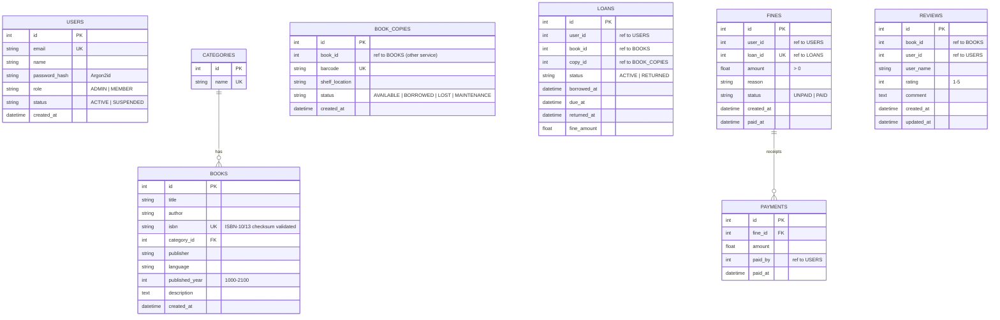

# Database design

**PostgreSQL 16**, one database per service (the *database-per-service* pattern), created by `deploy/postgres/init-databases.sql`. Tables are created automatically by each service on first start (SQLAlchemy). `auth_db` is shared by the three services that work on user accounts (Registration, Login, Member).

## Databases and tables
| Database | Used by | Tables |
|---|---|---|
| `auth_db` | registration, login, member | `users` |
| `catalog_db` | catalog (3 replicas) | `categories`, `books` |
| `inventory_db` | inventory | `book_copies` |
| `borrowing_db` | borrowing | `loans` |
| `fine_db` | fine | `fines`, `payments` |
| `review_db` | review | `reviews` |

## Relationships and constraints
**Enforced by the database (foreign keys inside a service)**
* `books.category_id → categories.id` (many books per category; the API still reads/writes the category as a name and creates it on first use, matching case-insensitively)
* `payments.fine_id → fines.id` with `ON DELETE CASCADE` (a fine has many payment receipts)

**Cross-service references** (`user_id`, `book_id`, `copy_id`, `loan_id`) are *logical* references: a database cannot hold a foreign key into another service's database. Integrity is enforced at the API level instead – e.g. Inventory and Review call Catalog to confirm the book exists, Borrowing asks Member whether the account is active and asks Inventory to reserve a real copy.

**Other constraints**
| Constraint | Where |
|---|---|
| `UNIQUE` | `users.email`, `books.isbn`, `categories.name`, `book_copies.barcode`, `fines.loan_id` (one automatic fine per loan), `reviews(book_id, user_id)` (one review per member per book) |
| `CHECK` | `users.role`, `users.status`, `book_copies.status`, `loans.status`, `fines.status`, `fines.amount > 0`, `reviews.rating BETWEEN 1 AND 5`, `books.published_year BETWEEN 1000 AND 2100` |
| Indexes | email, ISBN, title, author, category, user/book ids, statuses |
| Validation (API) | e-mail format, password rules (≥ 8 chars, letter + digit), ISBN check digit, rating range, amounts |

## CRUD coverage
| Entity | Create | Read | Update | Delete |
|---|---|---|---|---|
| User | `POST /auth/register` | `GET /auth/me`, `GET /members`, `GET /members/{id}` | `PUT /members/{id}`, `PATCH …/status`, `POST /auth/change-password` | – (accounts are suspended, not deleted, so history stays valid) |
| Category | automatic on book create | `GET /categories` | automatic on book update | – |
| Book | `POST /books` | `GET /books`, `GET /books/{id}` | `PUT /books/{id}` | `DELETE /books/{id}` |
| Copy | `POST /inventory/copies` | `GET /inventory/copies`, `…/{id}`, `…/availability/{book_id}` | `PATCH …/{id}/status` | `DELETE …/{id}` (not while on loan) |
| Loan | `POST /loans` | `GET /loans`, `/loans/my`, `/loans/{id}` | `POST /loans/{id}/return` | – (loans are a permanent history) |
| Fine | `POST /fines`, automatic on late return | `GET /fines`, `/fines/my`, `/fines/{id}` | `POST /fines/{id}/pay` | `DELETE /fines/{id}` (waive, unpaid only) |
| Payment | created by paying a fine | included in `GET /fines/{id}` | – | cascade with the fine |
| Review | `POST /reviews` | `GET /reviews`, `…/summary/{book_id}` | `PUT /reviews/{id}` | `DELETE /reviews/{id}` |

Data is persistent: PostgreSQL stores it in the `pgdata` Docker volume.
